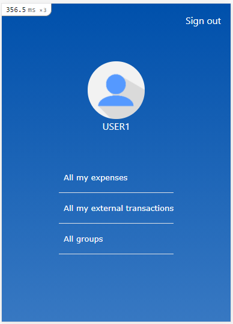
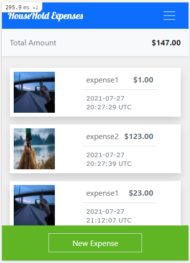

# HouseHold Expenses (RoR Module Capstone Project)

> This project was built for the [Microverse](https://www.microverse.org/) Ruby on Rails Module's Capstone Project. The project is based on a mobile app for grouping payments by a goal with the user's family/friends. We should follow a given design of a website, but we must personalize the content, for this project in particular we will be working on grouping the expenses of a house.




**Important**: As a project's requirement, a properly authenticated login is not a requirement. This is an extra feature.

## Built With

- Ruby 3.0.1
- Rails 6.1.4 (Ruby Gem)
- PostgreSQL 12.7
- Bootstrap 5

## Live Demo

[Live Demo Link]('https://nameless-fortress-27608.herokuapp.com/')

## Getting Started

To get a local copy up and running, please follow these steps:

### Prerequisites

For this project, the following environment should be previously installed on your machine:

- Ruby 3.0.1
- Rails 6.1.4
- PostgreSQL 12.7
- Node 14.17.0
- Yarn 1.22.10

### Setup

- Go to your terminal bash and, on any directory of your preference, run

```sh
git clone git@github.com:petumazo/Household-Expenses.git
```

- Next, to go into the project root directory, run

```sh
cd HouseHold-Expenses
```

- To install all Ruby Gems this project requires, run

```sh
bundle install
```

### Install

- Migrate databases needed for this project, run

```sh
rails db:create
rails db:migrate
```

- To start your localhost, run

```sh
rails server
```

You can stop your local server by pressing `<ctrl> + c` on your keyboard.

### Tests

- Your computer should have Google Chrome installed.
- At the root of the project, run

```sh
rspec
```

## Author

👤 **David Alvarez**

- GitHub: [@petumazo](https://github.com/petumazo)
- Twitter: [@petudeveloper](https://twitter.com/petudeveloper)
- LinkedIn: [LinkedIn](https://www.linkedin.com/in/david-alvarez-mazzo-777712143/)


## 🤝 Contributing

Contributions, issues, and feature requests are welcome!

Feel free to check the [issues page](https://github.com/petumazo/Household-Expenses/issues).

## Show your support

Give a ⭐️ if you like this project!

## Acknowledgments

- [Microverse](https://www.microverse.org/)
- [The Odin Project](https://www.theodinproject.com/)
- [Rails Guides](https://guides.rubyonrails.org/index.html)

## 📝 License

This project is [MIT](./LICENSE) licensed.